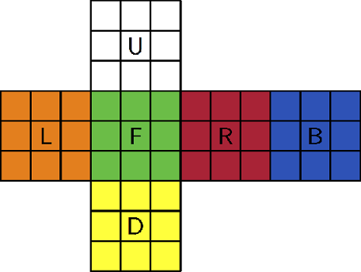

# Introduction

Dans le cadre du cours de traitement d'image à la He-arc, nous avons du réaliser un projet dans lequel les différents matières théorique vues pendant l'année devrait y être utilisées. Dans ce cadre nous avons proposé de réaliser une application en Python en utilisant OpenCV afin de détecter les différentes faces d'un rubik's cube afin de donner à l'utilisateur les mouvements à réaliser même si ce dernier n'a aucune connaissance du rubik's cube.

Les défis de ce projet sont multiples; il s'agira de détecter des zones à l'aide de la ségmentation et du pré-traitement d'image ainsi que de faire de la détection de couleurs.

De plus il s'agira de fournir à l'utilisateur final une application la plus simple qu'il sera possible de réaliser pour que la prise en main soit facilité.

## Contexte de développement

* Visual Code
* Python 3
* Open CV

\newpage

# Préambule

Tout au long de ce document plusieurs notations concernant le cube seront utilisées, cette section a pour but de définir le contexte utile à la bonne compréhension des différents chapitres qui vont suivre.

## Notation rubik's cube

Dans la litérature du cube, la notation du cube est codifié de manière standard par les appelations suivantes : `U(pper), L(eft), F(front), R(ight), B(ack), D(own)` ces différentes lettres correspondent chaucune à une face du cube.



Les couleurs ne sont pas fixées par rapport aux différentes lettres. Ainsi dans la suite du document et pour la résolution du rubik's cube en fin de traitement, il faudra tenir compte du fait que les mouvements de résolution seront donnés en partant du principe que la face F(ront) est la face rouge (l'élément central doit être rouge) et la face U(pper) est jaune. Une fois que ces deux éléments sont déterminés toutes les autres positions sont fixées ainsi on a que :

* L(eft) : face blue
* R(ight) : face verte
* B(ack) : face orange
* D(own) : face blance

évidemment cela n'est vrai que s'il s'agit d'un rubik's cube standard.

## Etape de conception

L'idée finale est de pouvoir analyser le rubik's cube en temps réel (vidéo) afin de détecter les différentes faces et d'y détecter les différentes couleurs associées aux neuf carrés qui composent une face.

voici les grandes étapes de conception pour la résolution de notre problématique

* Pré-traitement de l'image
* Détection de contours
* Détection de rectancle
* Détection des couleurs
* Convertion matricielle
* Résolution du rubik's cube

Les "points chauds" sont la détection  de contours et de couleurs qui sont très sensibles aux conditions dans lesquels sont menés les différents tests (condition de luminosité, type de caméra, fish eye, etc...). Il sera donc très difficile de trouver une solution qui sera assez générale pour convenir à tout type de caméra. Nous limiterons donc à l'utilisation de nos caméras intégrées à nos PC portables pour effectuer les tests ainsi que d'une bonne condition lumineuse (typiquement nous ne traitrons pas les cas de basses luminosité).

\newpage

# Pré-traitement

Le pré-traitement des données est une phase importante du traitement d'image, des images de bonnes qualités offrent souvent un meilleur angle d'attaque pour entamer un travail en traitement d'image. Dans cette section nous expliquerons tout d'abord comment l'acquisition des images a été réalisé et avec quel type d'images nous avons travaillé tout au long de ce projet pratique avant de passer en phase final sur de la vidéo en temps réel.

## Acquisition des données

Le premier objectif de ce travail a été de constituer un dataset sur lequel travailler pour formuler nos premières ébauches, c'est pourquoi nous avons choisi dans un premier temps de prendre des images avec nos téléphones dans des bonnes conditions de luminosité.

Voici quelques exemple d'images que nous avons utilisées pour nos premières phases de test :


Nous avons constitué deux datasets, dans chacun des datasets se trouve toutes les faces d'un cube mélangé de façon différente.

## Nuance de gris

Dans un premier temps il s'agit de travailler notre image brute pour retirer les informations inutiles ou qui peuvent mettre à mal la détection de contours. Comme notre image est en couleurs elle contient beaucoup d'informations qui ne nous sont pas vraiment très utiles pour découvrir les contours, on va donc grâce à OpenCV transformer notre image en nuance de gris.

````python
imgray = cv2.cvtColor(image, cv2.COLOR_BGR2GRAY)
````

## Bruit

Maintenant que notre image est en nuance de gris il va s'agir d'enlever les différents bruits présents dans l'image mais pas uniquement. Comme on peut le voir dans la figure \ref{colors-mixed} certains des autocolants ont un peu veilli et commencent à se décoller. Il faut donc faire en sorte que ces "parasites" n'affectent pas la détection des contours (et de couleurs par la même occasion). Pour ce faire nous allons utiliser un filtre gaussien pour harmoniser l'image.

```python
cv2.GaussianBlur(imgray,(13,13),10)
```

Nous avons choisi de travailler avec kernel de 13 pixels c'est, après plusieurs itérations, la valeur qui nous apportait les meilleures performances. Quant au sigma il permet de définir l'influence des pixels proches sur le calcul du pixel central. Encore une fois après plusieurs itérations, la valeur `10` a été la plus adéquate pour la suite du traitement.

Une fois ces deux transformations appliquées on obtient une image qui sera plus simple à analyser pour la suite de notre travail.


# Détection des carrés

Dans cette section nous verrons comment nous avons procédé pour détecter les différents carrés présents sur notre image puis nous verrons comment extraire les différentes couleurs afin de les classifier par la suite.

## Détection des contours

Dans cette partie il s'agit donc trouver les différents contours de notre rubik's cube, ici il existe deux approches possibles.

### Méthode 1

La première méthode consiste à simplement détecter le carré entier qui englobe la face puis en post-traitement découper les différents carrés internes. La taille des carrés en interne étant fixe

$$width = height = \frac{1}{3}\cdot\text{big square width}$$

Il est donc facile de deviner la position des différents carrés et de les extraire une fois que le carré englobant a été trouvé. Il faut cependant noter que du à notre rubik's cube qui contient des contours noirs et le fond de nos images dans nos datasets qui ont un fond noir elles aussi, cette technique n'a pas donné beaucoup de résultat.

### Méthode 2

La deuxième méthode, peut-être un peu plus complexe, consiste à détecter directement les 9 carrés qui se trouvent sur une face, cette technique a l'avantage de détecter exactement l'endroit où se trouve la couleur est donc on évite d'inclure une portion de l'image qui ne correspond pas à un couleur.

Cette technique est particulièrement intéressante car notre rubik's cube possède une délimitation claire entre chaque carré et donc il sera, dans de bonnes conditions, facile de détecter les différentes zones.

**Cette solution est celle qui a été retenue.**

## Canny

Afin de détecter les différents carrés nous allons donc appliquer la méthode "canny" d'openCV pour faire apparaitre les différents changements d'intensité en x et en y.

```python
cv2.Canny(imgray,0,30)
```

Les deux options 0 et 30 qui sont les threshold de détection de changement d'intensité ont été choisi par itération. Voici le résultat de détection des contours.


On peut constater que nos différents carrés sont détectés mais qu'il reste des contours parasites.

## Opération morphologique

Afin de ne garder que les contours qui nous intéressent nous allons successivement appliquer plusieurs opérations morphologiques pour tenter d'isoler les différents carrés de notre face.

### Fermeture

La fermeture est une dilation suivi d'une érosion, elle a pour principe de "boucher" les différents trous qui se trouvent sur notre image. Cette étape aura surtout pour objectif de faire apparaitre les différentes séparation entre les carrés.

```python
apply_morph_operation(edges, cv2.MORPH_CLOSE, size=(5,5), it=1)
```

Le kernel choisi est choisi petit afin de surtout combler les petits "bruit" détectés.

### Dilatation

Une fois que les séparations entre les carrées sont apparues, nous allons appliquer une morphologie de dilatation, ceci va permettre de mieux marquer les zones de séparations entre les carrés.

```python
apply_morph_operation(edges, cv2.MORPH_DILATE, size=(4,4), it=5)
```

Cette opération va être effectuée avec un kernel de taille 4 et l'opération va être renouvelée 5 fois.

### Fermeture

Après la dilation on peut déjà constater sur la figure \ref{morph} clairement nos carrés apparaitre, cependant leurs coutours ne sont pas très droit comme nous aurons besoin de détecter des carrés par après, nous appliquons une dernière fermeture afin de rendre les contours plus "lisses".

```python
apply_morph_operation(edges, cv2.MORPH_CLOSE, size=(6,6), it=8)
```

Cette fois-ci notre kernel doit être plus grand car on cherche vraiment a éliminer les petites impuretés sur les bords de nos carrés.

### Résultat

Le résultat des différentes opérations morphologiques successives ci-dessus sont visibles sur la figure suivante


## Trouver les carrés

A partir de la dernière image obtenue sur la dernière morphologie, à savoir, celle-ci :


nous allons appliquer un algorithme de détection des points de contours, nommé "Suzuki 85", à l'aide d'openCV.

```python
cv2.findContours(edges, cv2.RETR_TREE, cv2.CHAIN_APPROX_SIMPLE)
```

Cette fonction nous retourne une liste de points pour chaque forme détectée, à partir de ces données nous allons utiliser la fonction

```python
cv2.approxPolyDP(cnt,epsilon,True)
```

Elle nous permettra de trouver une approximation de contours en partant des points trouvés précédemment.


Comme mentionné dans la [documentation d'open CV](https://opencv-python-tutroals.readthedocs.io/en/latest/py_tutorials/py_imgproc/py_contours/py_contour_features/py_contour_features.html) cette approche permet de détecter des carrés même si leur contours ne sont pas très bien définis.

### Filtre des "bons carrés"

Lorsque l'approximation des contours est effectué sur les différents groupes de points il faut encore filtrer pour ne garder que les éléments qui peuvent constituer des carrés potentiels.

Le premier filtre est très simple on ne garde que les formes qui sont composées de 4 côtés.

#### Médiane des airs

Comme nous cherchons neuf carrés à peu près similaires, nous établissons la médiane des airs détectés ainsi nous allons garder que les formes qui sont proche de cette médiane.

#### Ratio hauteur/largeur

Dans notre cas le ratio hauteur/largeur n'a pas été exploité par manque de temps mais il peut-être une bonne caractéristique pour ne garder que les formes plus ou moins carrées.

#### Aire englobante minimum

Une des problématiques qui peut survenir lors de l'analyse des carrés présent dans l'image est la détection de carrés "parasites" hors de la zone du rubik's cube (carré présent dans l'environnement autour du rubik's cube) afin de limiter ce genre de phénomène une solution aurait été de trouver les neuf carrés dont l'air du carré les englobant est le plus petit. Cette approche n'a pas été implémentée par manque de temps.

### Tri des carrés

Une fois que les carrés sont détectés nous avons tous les carrés dans le désordre, l'idée de cette étape est donc de trier les différents carrés pour les obtenir sous la forme raw major.


Afin d'obtenir cette liste, un premier tri est effectué sur tous les carrés obtenus sur leur composante X. Puis un second tri, 3 par 3 (tri par ligne), est effectué sur leur composante Y.

## Détection des couleurs

Dans cette section nous allons décrire comment nous avons procédé pour détecter les différentes couleurs présentent dans le rubik's cube.

Le rubik's cube est composé de 6 faces, il possède donc 6 couleurs distinctes, les couleurs seront référencées sous la forme HSV dans notre programme sous la forme de constantes.

```{.python caption="Constantes des couleurs"}
colors = {
'orange': ([7, 110, 125], [20, 255, 255]),    # Orange
'yellow': ([26, 110, 100], [40, 255, 255]),   # Yellow
'green' : ([40, 52, 72], [80, 255, 255]),     # Green
'red' : ([160, 100, 84], [179, 255, 255]),    # Red
'red2' : ([0, 100, 84], [6, 255, 255]),       # Red
'white': ([0, 0, 168], [160, 200, 255]),      # White
'blue': ([85, 90, 100], [125, 255, 255]),     # Blue
}
```

Ces constantes correspondent au seuil bas et haut de détection d'une couleur HSV par rapport à nos tests, évidemment ces valeurs sont très dépendantes des conditions de la prise des images.

On notera que le rouge possède deux entrées, ceci est explicable par le fait que la notation HSV est une roue de couleur et donc le rouge peut se trouver en début ou en fin de la plage de couleur.


Pour la suite de notre traitement il faut donc que notre image orignale soit convertie au format HSV.

### Extraction des couleurs

Grâce à la détection des carrés nous sommes en mesure de découper dans l'image originale au format HSV les zones qui nous intéressent afin d'effectuer une détection de la couleur par la suite.

#### classification

Pour effectuer la classification, nous allons simplement comparer notre portion d'image avec les différents seuil de couleur défini en début de section.

```{.python caption="Masque de détection"}
# create NumPy arrays from the boundaries
lower = np.array(lower, dtype = "uint8")
upper = np.array(upper, dtype = "uint8")

# find the colors within the specified boundaries and apply
# the mask
mask = cv2.inRange(image, lower, upper)
output = cv2.bitwise_and(image, image, mask = mask)
```

On compare le masque créé pour chaque couleur avec l'image originale à l'aide d'un bitwise operator, tous les pixels seront alors transformés en `1` si matching en `0` sinon. Dans en second temps nous allons compter le nombre de pixel "allumé" pour savoir si la couleur est présente dans l'image ou non.

```{.python caption="Détection et normalisation"}
# count the number of pixel matching and normalize it (value between 0 and 1)
nonzero_normalized = np.count_nonzero(output) / output.size
```

Nous effectuons directement une normalisation en divisant le résultat par le nombre total de pixels afin d'obtenir le pourcentage de "matching".

Dès qu'une couleur atteint un threshold défini (par défaut 30%) on considère que la couleur a été trouvée.


##### Amélioration

Le code actuel renvoie directement la couleur si elle atteint 30% les autres détections ne sont donc pas effectuées, il serait intéressant d'effectuer la détection de toutes les couleurs puis de renvoyer celle qui obtient le meilleur matching.

\newpage

# Application

Dans cette section nous détailerons succintement le développement de l'application Kyubi ainsi que son utilisation.

## Architecture

le code produit à donner lieu à deux fichiers python.

### Kuybi_solver.py

Ce script contient toutes les fonctions utiles pour détecter les cases et les couleurs du rubik's cube, le point d'entrée principal est la méthode suinvante :

` annoted_frame, faces = get_face_colors(frame, debug=False)`

Cette fonction prend simplement une image en entrée et donne en retour la même frame avec des annotations pour indiquer graphiquement ce que la fonction a pu detecter ainsi qu'un paramètre `faces` qui contient les initiales des couleurs detectées sur l'image `['G', 'W', 'R', ...]` (en notation raw major).

### Kyubi.py

Ce script python est l'entrée principale de notre programme c'est lui qui va se charger de récupérer les différentes frame de la caméra et de dialoguer avec l'utilisateur.

La difficulté dans cette partie réside dans le fait que nous devons récupérer le rubik's dans un ordre très précis car si chaque face peut être detectée indépendamment la liste des différents carrés doit être donnée dans un ordre très précis.

```{.txt caption="Ordre des différents carrés"}
               ----------------
               | 0  | 1  | 2  |
               ----------------
               | 3  | 4  | 5  |
               ----------------
               | 6  | 7  | 8  |
               ----------------
-------------------------------------------------------------
| 9  | 10 | 11 | 18 | 19 | 20 | 27 | 28 | 29 | 36 | 37 | 38 |
-------------------------------------------------------------
| 12 | 13 | 14 | 21 | 22 | 23 | 30 | 31 | 32 | 39 | 40 | 41 |
-------------------------------------------------------------
| 15 | 16 | 17 | 24 | 25 | 26 | 33 | 34 | 35 | 42 | 43 | 44 |
-------------------------------------------------------------
               ----------------
               | 45 | 46 | 47 |
               ----------------
               | 48 | 49 | 50 |
               ----------------
               | 51 | 52 | 53 |
               ----------------
```

Cette ordre est imposé par le module [rubik_solver](https://pypi.org/project/rubik-solver/) que nous utilisons.

## Interface utilisateur

Afin de guider l'utilisateur dans les différentes étapes de détection, nous avons développé un scénario pour détecter les différentes faces les unes après les autres.


Ces différents messages apparaitrons sur l'interface utilisateur pour le guider sur la face qu'il faut détecter.


A l'ouverture de l'application le premier message apparait, il permet à l'utilisateur de savoir quelle face il doit montrer en premier.

Dès que l'utilisateur montre le rubik's cube la détection se fait automatique, dès que la face est bien detectée et que le centre correspond bien à la face attendue alors l'image se fixe et l'utilisateur peut choisir de valider l'opération avec la touche `v` ou continuer de chercher avec la lettre `c`.

L'utilisateur peut quitter l'application à tout moment en appuyant sur la touche `q`.

### module rubik-solver

Pour résoudre le rubik's cube nous utilisons la librairie rubik-solver qui nous donne les différents coup à jouer selon la méthode `Kociemba`.

Ce module impose que les faces soient données dans un ordre spécial cependant cet ordre peut-être pénible à suivre pour l'utilisateur, c'est pour cela que le scénario utilisateur est optimisé pour demander le moins de mouvements possible à l'utilisateur. Cela nous oblige a remplacer les différentes face dans l'odre après coup pour ensuite utiliser la librairie.

```{.python caption="Echange des différentes faces pour utiliser le rubik-solver"}
    # swap faces to match solver pattern
    cube[2], cube[1] = cube[1], cube[2]
    cube[4], cube[5] = cube[5], cube[4]
    cube[3], cube[5] = cube[5], cube[3]
```

#### Résolution

les mouvements de résolution sont donnés sous le format standard.


Il suffit de suivre les mouvements donnés en gardant en tête que la face F(ront) correspond à la face avec un centre rouge et la face U(pper) correspond à la face avec un centre jaune.

Une vidéo de démonstration est fournie en annexe de ce document.

\newpage

# Probématiques rencontrées

Cette section regroupe les différentes problématiquse restantes sur le projet Kyubi.

## Conditions luminosité

Une des plus grande difficultée du projet a été la détection des couleurs car elle est très dépendante des conditions de luminosité de la caméra. Il se peut donc que sous certaines conditions les couleurs soient confondues entre elles ou pire qu'elles ne soient pas detectées du tout.

## Type de caméra

Nous avons eu l'occasion de tester l'application sur une caméra avec un grand angle, les déformations impactent sensiblement la détection des carrés. Il faudrait pouvoir calibrer la caméra avant la détection mais cela aurait demandé trop de travail nous avons donc abandonner cette idée et préféré nous concentrer sur une seule et même caméra.

## Détection des carrés

La détection des formes ayant 4 côtés est parfois trop permissive, il se peut que des formes, comme des trapèzoïdes soient détectés comme des carrés (il serait mieux de parler de rectancle dans ce cas) alors que ça n'a pas lieu d'être.


\newpage

# Conclusion

La réalisation du projet nous a permis d'exploiter énormement d'éléments théoriques qui ont été vu en cours. Notre problématique s'appliquant très bien au cours de traitement d'image. Grâce aux différentes informations dispensés pendant les cours il nous a été facile de trouver une bonne direction à prendre pour se diriger rapidement vers une solution qui n'est pas parfaite mais qui est fonctionnel et robuste. Nous avons donc pu voir le pré-traitement d'image avec notamment l'utilisation du GaussianBlur, la segmentation d'image, les différentes opérations morphologiques, la détection de couleurs et plus encore. Ce projet a été l'occasion de mettre ensemble ces différentes techniques, que nous avions vues séparément, ensemble dans une pipeline de traitement pour obtenir un produit final.

Nous avons aussi pu constater à quel point nous sommes très dépendant des conditions de prise d'images et qu'il est très difficile d'obtenir un produit qui puisse bien réagir sous toutes les conditions.
